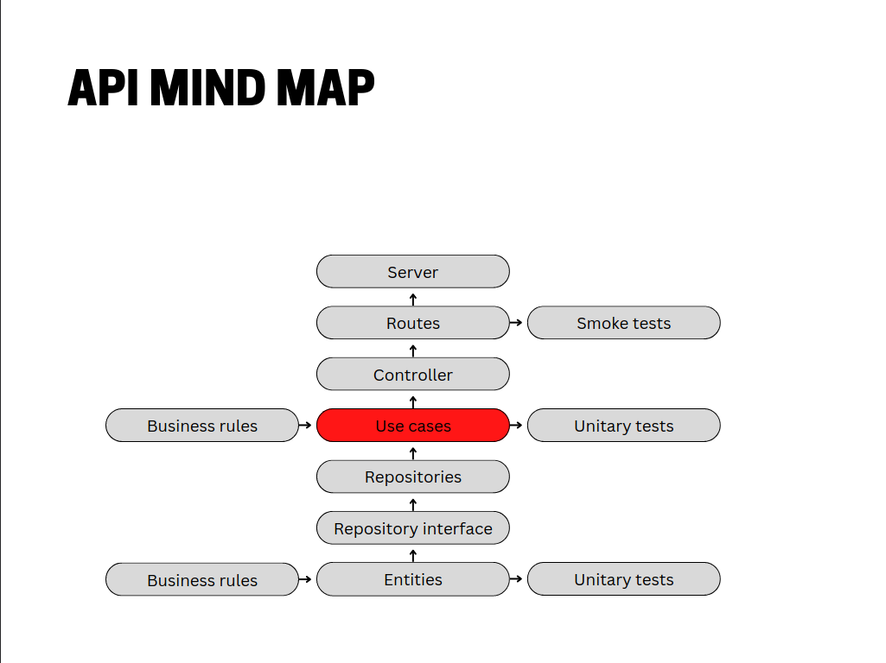

  

1º - Models
2º - Configs
3º - Database
4º - Repositories
5º - Controllers        (Business rules)
6º - Routes
7º - Server             (Smoke tests)

=====================

1º - Models
2º - Configs
3º - Database
4º - Repositories
5º - Use cases          (Business rules)
6º - Unitaries tests
7º - Controllers
8º - Routes
9º - Server             (Smoke tests)
